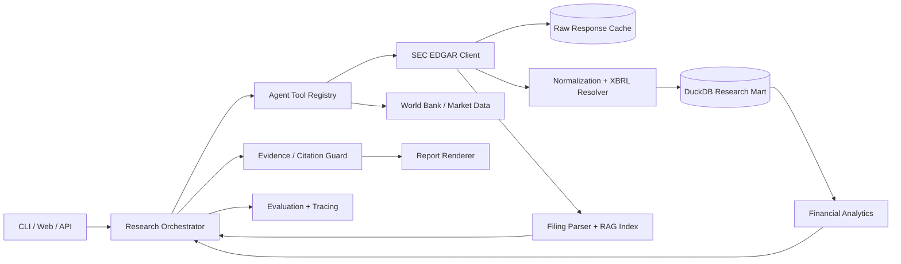

# SEC Financial Research Agent

A production-oriented AI engineering portfolio project that turns public SEC EDGAR filings and XBRL facts into cited financial research. The first vertical slice is a fully runnable live-data report; the one-week roadmap adds filing RAG, agent tools, evaluations, an API, a web demo, observability, Docker, and CI.

## Live public data

The project uses official SEC endpoints—no private dataset and no fabricated company metrics:

- Company ticker registry: `https://www.sec.gov/files/company_tickers.json`
- Company facts/XBRL: `https://data.sec.gov/api/xbrl/companyfacts/CIK##########.json`
- Filing archive citations: `https://www.sec.gov/Archives/edgar/data/...`

SEC asks automated clients to identify themselves. Configure `SEC_USER_AGENT` with an application name and contact email; `.env.example` shows the format.

## Working demo

```bash
uv run --group dev pytest
uv run sec-research report AAPL
uv run sec-research report MSFT --format json
uv run sec-research compare AAPL NVDA
uv run sec-research compare AAPL NVDA --format json --output artifacts/aapl-nvda.json
uv run sec-research mart-load AAPL --database .cache/research.duckdb
```

The `report` command resolves a ticker, fetches/cache-controls SEC Companyfacts, extracts comparable annual facts, computes research ratios, and prints a report with links to the SEC source and filing. `compare` accepts two or more distinct tickers, normalizes reported USD metrics to billions, ranks every calculated percentage from highest to lowest, and retains Companyfacts and filing citations for each issuer. Fiscal period ends remain visible, and the ranking is descriptive rather than an investment rating. A committed single-company example is available at [`examples/sample-aapl-report.md`](examples/sample-aapl-report.md).

### XBRL concepts and comparable periods

The annual resolver evaluates ordered US-GAAP aliases for every fiscal period instead of locking onto the first concept found. This handles issuer taxonomy transitions such as NVIDIA moving from `RevenueFromContractWithCustomerExcludingAssessedTax` to `Revenues`, while preserving preferred-concept precedence when aliases overlap. Snapshot ratios require every metric to match the selected fiscal end. Revenue growth requires a prior annual end 330–400 days before the latest period, accommodating 52/53-week calendars without treating multi-year gaps as year-over-year growth. Missing or non-comparable data is reported as unsupported instead of silently mixing periods.

Deterministic tests use compact, SEC-derived Apple and NVIDIA Companyfacts fixtures. Each multi-issuer fixture retains filing accessions, period metadata, and its official Companyfacts endpoint provenance.

### DuckDB research mart

`mart-load` runs the cited company-report pipeline, then atomically replaces that
company and fiscal-period slice in a local DuckDB database. Repeating the command
is idempotent: primary keys prevent duplicate metric or ratio rows. The
`financial_metric_facts` table retains ticker/CIK, fiscal period, source value and
unit, XBRL concept, filing date, SEC accession, official Companyfacts URL, and
ingestion timestamp. `financial_ratios` stores calculated percentages alongside
the calculation version and source accessions.

Pre-ingestion quality gates reject a Companyfacts URL that does not match the CIK,
facts from a different fiscal period, and accessions belonging to a different
issuer. The command queries both tables after loading and prints the persisted row
counts, so it doubles as a lightweight ingestion/query smoke path. The default
database is `.cache/research.duckdb`, which remains outside version control.

### Cache and failure diagnostics

Each SEC response records retrieval metadata on the client as `network`, `fresh`, or `stale`, including cache age and any refresh error. If a refresh exhausts transient retries, the CLI can continue from an expired cached response and emits a visible warning to stderr without contaminating Markdown or JSON report output. Non-retryable HTTP failures stop after one attempt and report the endpoint, status, attempt count, and whether a usable cache was available.

## Production architecture



### Architectural principles

- **Ports and adapters:** external APIs are isolated behind clients so services and tests stay deterministic.
- **Evidence first:** every conclusion carries an SEC endpoint or filing citation.
- **Reliable ingestion:** descriptive User-Agent, throttling, retries, timeouts, cache TTL, and atomic cache writes.
- **Deterministic analytics:** ratios are calculated from normalized facts, not guessed by an LLM.
- **AI where it adds value:** filing retrieval, question routing, synthesis, and narrative—never silent arithmetic.
- **Production proof:** unit/integration tests, evaluation datasets, API contracts, observability, Docker, and CI.

## Current scope

The initial commit delivers the first vertical slice:

1. Resolve a public-company ticker to CIK.
2. Download and cache SEC Companyfacts.
3. Normalize annual Revenue, Net Income, Assets, Liabilities, and Operating Cash Flow across issuer-specific concept histories.
4. Calculate revenue growth, net margin, liabilities/assets, and cash conversion.
5. Render Markdown or JSON with source citations.
6. Compare multiple issuers with USD-billion metrics, deterministic ratio rankings, visible fiscal ends, and per-company evidence.

See [`docs/roadmap.md`](docs/roadmap.md) for the complete one-week plan and [`docs/architecture.md`](docs/architecture.md) for component boundaries.

## Disclaimer

This repository is for engineering demonstration and educational research. It is not investment advice.
