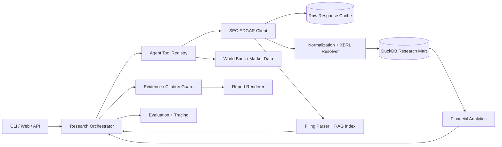

# SEC Financial Research Agent

A production-oriented AI engineering portfolio project that turns public SEC EDGAR filings and XBRL facts into cited financial research. The first vertical slice is a fully runnable live-data report; the one-week roadmap adds filing RAG, agent tools, evaluations, an API, a web demo, observability, Docker, and CI.

## Live public data

The project uses official SEC endpoints—no private dataset and no fabricated company metrics:

- Company ticker registry: `https://www.sec.gov/files/company_tickers.json`
- Company facts/XBRL: `https://data.sec.gov/api/xbrl/companyfacts/CIK##########.json`
- Filing archive citations: `https://www.sec.gov/Archives/edgar/data/...`

SEC asks automated clients to identify themselves. Configure `SEC_USER_AGENT` with an application name and contact email; `.env.example` shows the format.

## Working demo

```bash
uv run --group dev pytest
uv run sec-research report AAPL
uv run sec-research report MSFT --format json
```

The command resolves the ticker, fetches/cache-controls SEC Companyfacts, extracts comparable annual facts, computes research ratios, and prints a report with links to the SEC source and filing. A committed example is available at [`examples/sample-aapl-report.md`](examples/sample-aapl-report.md).

## Production architecture



### Architectural principles

- **Ports and adapters:** external APIs are isolated behind clients so services and tests stay deterministic.
- **Evidence first:** every conclusion carries an SEC endpoint or filing citation.
- **Reliable ingestion:** descriptive User-Agent, throttling, retries, timeouts, cache TTL, and atomic cache writes.
- **Deterministic analytics:** ratios are calculated from normalized facts, not guessed by an LLM.
- **AI where it adds value:** filing retrieval, question routing, synthesis, and narrative—never silent arithmetic.
- **Production proof:** unit/integration tests, evaluation datasets, API contracts, observability, Docker, and CI.

## Current scope

The initial commit delivers the first vertical slice:

1. Resolve a public-company ticker to CIK.
2. Download and cache SEC Companyfacts.
3. Normalize annual Revenue, Net Income, Assets, Liabilities, and Operating Cash Flow.
4. Calculate revenue growth, net margin, liabilities/assets, and cash conversion.
5. Render Markdown or JSON with source citations.

See [`docs/roadmap.md`](docs/roadmap.md) for the complete one-week plan and [`docs/architecture.md`](docs/architecture.md) for component boundaries.

## Disclaimer

This repository is for engineering demonstration and educational research. It is not investment advice.
